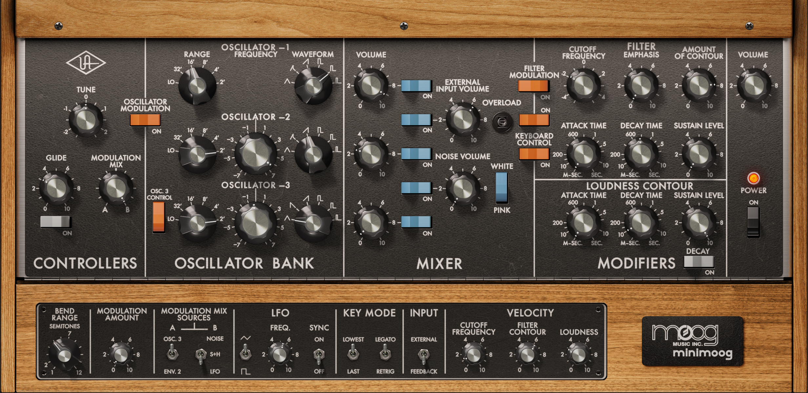

Live-coding is a performance form where musician-coders compose code that
makes music while you watch:

<!-- I imagine that live-coding music is the closest one can get to feeling like a
hacker cruising through cyberspace engaging **ICE** (Intrusion Countermeasures
Electronics) in hand-to-hand combat that looks like a dance.

The musician, Switch Angel, has created a microgenre that runs off vicarious
enjoyment of this. Jack in: -->

::: {#fig-switchangel}



Switch Angel demonstrates some "old [tɹɑːns] tricks" with the live-coding tool,
Strudel.

:::

The tool that Switch Angel is using in that video is
[Strudel](https://strudel.cc/workshop/getting-started/). Its most striking
feature is the use of pattern microformats[^microformats] to define rhythm
and melody.

[^microformats]: The specific microformats Strudel uses are lifted directly from
[Tidal Cycles](https://tidalcycles.org/), a Haskell-based tool that pioneered
this whole approach to live coding, albeit building on decades of previous work
from the SuperCollider community and others.

The sounds we hear though, are generated by a synthesizer that combines a
basic sampler and standard pipeline of audio FX units. When Switch Angel
invokes `duck` to make the kick drum pump through the bassline, she's
configuring [one of those standard FX
units](https://strudel.cc/learn/effects/#duck).

Other live-coding tools, such as
[SuperCollider](http://supercollider.github.io), are infinitely flexible, bound
only by your imagination and your CPU. But in Strudel the synthesizer is
hard-coded: it's not possible to vary it within Strudel itself.

And it's monolithic: all the functionality is bolted on to a single object, like
a Swiss army knife with tweezers, a magnifying glass, a pair of miniature
scissors, a tin opener, a tool for doing something to a horse, a corkscrew, a
wrench, and three types of nail file.

A hard-coded monolith runs against normal design instincts in software where we
favour modularity, abstraction, and separation of concerns. So, at first blush,
it struck me as poor design.

In fact, it's the **genius** of the thing.

## Knob-per-function

Up until the 1980s, synthesizers had a simple signal pipeline. There were
relatively few parameters, and each had a lovely big knob to twist.

{#fig-minimoog}

In contrast, the digital synths of the 1980s and 90s offered more power but at a
price. Digital synths had hundreds or thousands of parameters, but they were
buried behind a tiny LCD screen and a couple of rubbery menu buttons.

The loss of immediacy translated into a professionalisation of sound design.
Early dance music runs on live tweaking the six-parameter birdsong of the Roland
303[^303eternal]. Conversely, the hallmark of 90s dance is the
manufacturer preset -- think of the iconic Korg M1 [Piano
16ft](https://youtu.be/m_Qr2zqBwYA?si=qFLrv4pZVQeAxeKq) or Roland D-50
[Pizzagogo](https://youtu.be/NtqCGy8DKwI?si=ZuZ9MzNZg4WYWAen&t=34).

[^303eternal]: Aside from its primitive synthesizer, the 303 had a primitive
sequencer. This was so obtuse that it forced musicians to discover new patterns
    rather than write them. Strudel's microformats do this too, but that's
    another essay.

Since the 2000s, there has been a marked swing back to
 "knob-per-function"[^hydrasynth]. Most knobs never get used, but they're there
and you can tweak them. You can **play** the instrument.

[^hydrasynth]: Albeit often with innovations to lessen the trade-off, perhaps
best exemplified by Ashun Sound Machines' wonderful
[Hydrasynth](https://youtu.be/RqetBg7ySWY?si=ysaYdauCiUGKwAAO).

## APIs you can play

Strudel, then, is a knob-per-function API. It exposes each parameter of the
synth as a separate method. They can be chained together into a single
expression and executed with a satisfying `Ctrl-Enter`.

The infinite flexibility of the underlying digital signal processing engine is
traded for the immediate kineticism of an analog front panel.

Libraries for interactive data analysis and other exploratory work share
something of this instinct: `pandas`, `numpy` and `torch` have big, flat
top-level namespaces stuffed with functions to tab-complete. The pattern recurs
wherever the loop needs to be tight.

It's a reminder that good design is often a matter of breaking the rules.
